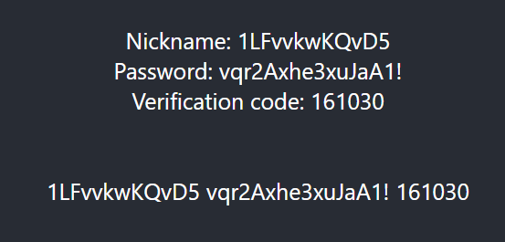

# Twitch account creator with puppeteer with fingerprints

This repository contains scripts to generate twitch accounts with verification code that we can pass after we log in to this account. For now code is set to generate random nickname, password and use 10minutemail. It also uses [puppeteer-with-fingerprints](https://github.com/CheshireCaat/puppeteer-with-fingerprints) which helps us not be detected as a bot.

Short video of the script getting data.

https://github.com/bdttd000/twitch-account-creator/assets/44643460/a14a3820-cd91-4b9f-94a4-8021c4489df5

### How it works

Using [puppeteer-with-fingerprints](https://github.com/CheshireCaat/puppeteer-with-fingerprints) we create a browser on which we run the following steps

- create the browser
- get to the registation form on [twitch](https://www.twitch.tv/)
- get the eamil from [email page](https://temp-mail.org/en/10minutemail)
- pass all the information to the regitation form
- get the activation code from [email page](https://temp-mail.org/en/10minutemail)
- close the browser

If everything works out, you will end with new account

Script is set to generate as much accounts as it can. The limit is the limitation from [email page](https://temp-mail.org/en/10minutemail). We won't be possible to generate new mails after about 10 tries. It all depends on our luck, but we can use a VPN that will refresh the cooldown.

While using VPN i suggest you to uncomment 'headless: false' option in 'server/src/scrapper.js'. Mainly because you will be asked to perform a captcha.

Script may fail if our [puppeteer](https://github.com/CheshireCaat/puppeteer-with-fingerprints) will be detected as a wrong browser or we won't get email from [email page](https://temp-mail.org/en/10minutemail). The first option will just close the browser and create another, but the second will terminate our script, beacuse there is nothing more to be done for about an hour (about this time we will be able to generate new emails).

### Example output

The string you will get consists of [login] [passowrd] [verification_code]

### Why don't we activate account right away?

The reason is simple. After the script ends you won't be able to access out 10 minute mail. Why is this a problem? mainly because we will receive a message regarding logging in from another device and we will be forced to enter another code from an email that we no longer have access to.

### Setup

clone repository
go to main folder and execute commands

- first terminal
  `cd .\client\`
  `npm install`
  `npm start`
- second terminal
  `cd .\server\`
  `npm install`
  `npm start`

now you can open [Localhost](http://localhost:3000/) and execute program

### Future functionalities

- Script has arguments such as 'login' and 'password', but i assume they will be useless as these accounts are fragile. We don't have access to the email so any ban is probably permanent.
- There is an option to add captcha solver which will solve our problem with vpn.

### Possible errors

- There are three different types of registration forms on Twitch, but the script only handles two of them correctly because the third one occurs very rarely. If it becomes a problem, I will fix it.
- The captcha will block us from obtaining the email. There are two solutions to this. Either you uncomment the 'headless: false' option in 'server/src/scrapper.js' and pass it manually, or you can implement a captcha solver.
